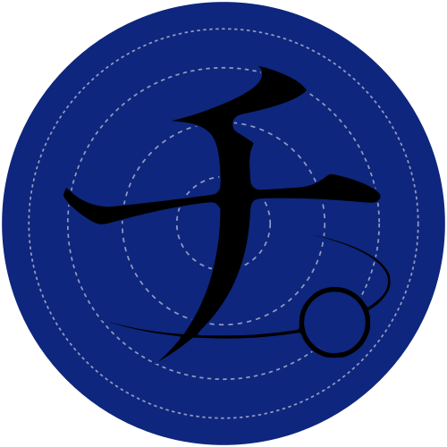

<a href="https://en.wikipedia.org/wiki/Orb:_On_the_Movements_of_the_Earth">

</a>

### Orb

[Newtonian solar system simulation](https://plutoniumm.github.io/orb/)

There is no center of the solar system. You can use any planet as the center, or any point in space for that matter. The rules of gravity will still apply the same way.

When using the Sun, we recover the traditional heliocentric model first described by Copernicus in the 16th century. And, when using the Earth, we recover the geocentric model first described by Ptolemy in the 2nd century, with all it's epicycles and deferents.

**Click any body** to make it the origin `(0,0)`. The physics never changes — only the frame you watch it from. Trails are drawn in that frame, so the Sun gives clean ellipses and the Earth gives epicycles.

### Develop

Needs `node` (for the app) and, only to regenerate the data, `python3`.

```bash
npm install

make dev      # local dev server (hot reload)
make build    # production build into ./dist
make deploy   # build + publish ./dist to GitHub Pages
make init     # regenerate data/planets.json from the JPL DE440 ephemeris
```

### How it works

- `data/planets.json` — a snapshot of planet positions/velocities at one epoch, generated by `index.py` from JPL's DE440 ephemeris and pre-scaled so the system fits a `[-10, 10]` box.
- `src/sim/` — pure, renderer-agnostic physics: an N-body Newtonian force (`G = 1`, masses in solar masses) integrated with velocity-Verlet.
- `src/render/` — draws bodies and reference-frame trails to a canvas.
- `src/worker.ts` — runs the physics + rendering loop against a transferred `OffscreenCanvas`.
- `src/main.ts` — the only code on the main thread: it bootstraps the worker and forwards input, so the UI thread never blocks.

> Requires a browser with `OffscreenCanvas` 2D support in workers (Chrome/Edge, Firefox, Safari 16.4+).

### Controls

| | |
|---|---|
| Click body | recenter on it (empty space → Sun) |
| Drag | pan |
| Wheel / ↑ ↓ | zoom |
| ← → | simulation speed |
| Space | pause |
